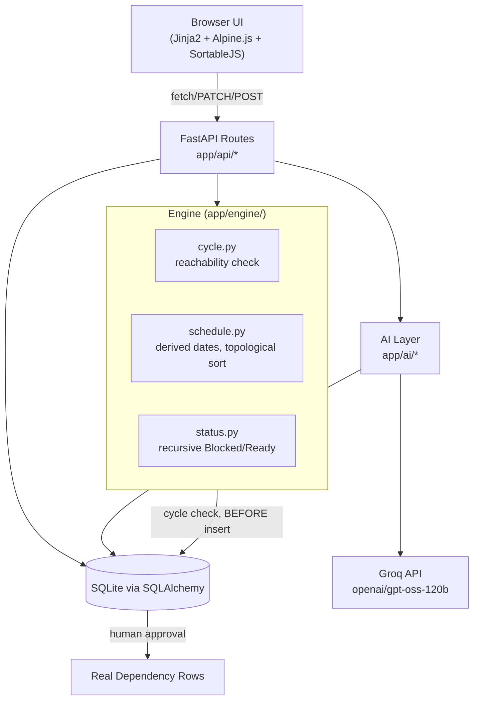
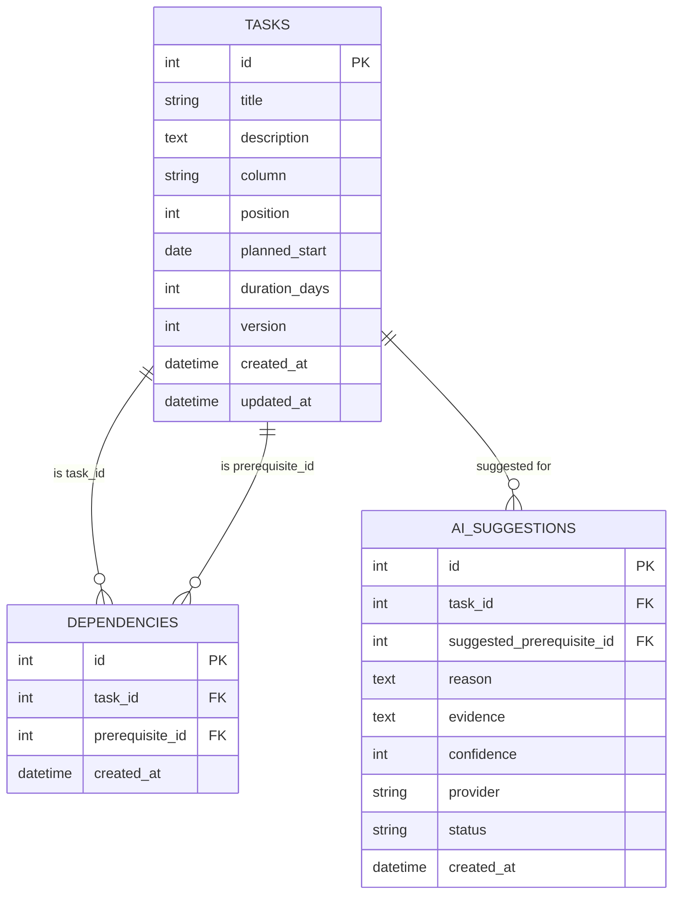

# 🧩 TaskFlow Pro

**A dependency-aware Kanban board with an AI-assisted dependency engine — built for Contata Hackathon 2026.**

<p align="left">
  
  
  
  
  
  
</p>

---

## 📖 Table of Contents

- [Overview](#-overview)
- [Core Requirements Solved](#-core-requirements-solved)
- [Architecture](#-architecture)
- [Data Model](#-data-model)
- [Key Design Decisions](#-key-design-decisions)
- [The Dependency Engine](#-the-dependency-engine)
- [AI / LLM Component](#-ai--llm-component)
- [Evaluation Results](#-evaluation-results)
- [Critical Path & What-if Preview](#-critical-path--what-if-preview)
- [Tech Stack](#-tech-stack)
- [Project Structure](#-project-structure)
- [Setup & Installation](#-setup--installation)
- [API Reference](#-api-reference)
- [Testing](#-testing)
- [Known Assumptions & Limitations](#-known-assumptions--limitations)
- [Author](#-author)
- [AI-Tool Assistance Disclosure](#-ai-tool-assistance-disclosure)

---

## 🎯 Overview

TaskFlow Pro is a **4-column Kanban board** (`Backlog → In Progress → Review → Done`) where tasks can declare **prerequisite dependencies** on one another. The board understands a project as a **Directed Acyclic Graph (DAG)**:

- Dragging a card persists its column/position instantly.
- Adding a dependency is rejected outright — before it's ever written to the database — if it would create a cycle.
- Every task's schedule (start/end date) is **derived live** from its dependency chain, never stored as an accumulated offset — so slippage never double-counts across converging paths.
- An AI layer can **suggest** dependencies or **generate whole sub-task breakdowns** from a feature description, but every suggestion is grounded, schema-validated, and requires human approval before it touches the real dependency graph.

---

## ✅ Core Requirements Solved

| Requirement | Status | Where |
|---|---|---|
| 4-column board, drag & drop, persisted | ✅ | `app/templates/board.html`, `app/static/board.js` |
| Create/manage tasks & dependencies | ✅ | `app/api/tasks.py`, `app/api/dependencies.py` |
| Dynamic Blocked/Ready status | ✅ | `app/engine/status.py` (recomputed live, never stored) |
| **No Cycles** — rejected before persisting | ✅ | `app/engine/cycle.py` + `app/api/dependencies.py` |
| **No Compounding** — converging paths don't double-count | ✅ | `app/engine/schedule.py` (derived dates via `max()`, never accumulated) |
| **Rollback on Regression** — cascades through all levels | ✅ | `app/engine/status.py` (recursive "effectively done" check) |
| Persistence across refresh | ✅ | SQLite via SQLAlchemy |
| Mandatory AI/LLM component (grounded, human-validated) | ✅ | `app/ai/` (see [AI / LLM Component](#-ai--llm-component)) |
| Critical Path / What-if (bonus) | ✅ | `app/engine/critical_path.py`, `app/api/critical_path.py`, `app/api/whatif.py` |

---

## 🏗 Architecture



**Why this separation matters:** `app/engine/` has **zero dependency on FastAPI or the database** — every function takes plain dicts in and returns plain dicts out. This is what let the engine be built and property-tested (500+ randomized cases per module) *before* any API or UI code existed, and it's why the same functions can be unit-tested in milliseconds without touching SQLite.

---

## 🗄 Data Model



- `dependencies.(task_id, prerequisite_id)` has a **UNIQUE constraint** — duplicate edges are impossible at the DB layer.
- `dependencies` has a **CHECK constraint** `task_id != prerequisite_id` — self-loops are rejected before the engine even runs.
- `ai_suggestions.status` is one of `pending | approved | rejected` — this is the human-approval gate. **The AI never writes to the `dependencies` table directly.**

---

## 🧠 Key Design Decisions

### 1. Dates are derived, never accumulated
Every task's `computed_start` is recalculated on every read as:

```
computed_start = max(own planned_start, max(prerequisite.computed_end for each prerequisite))
computed_end   = computed_start + duration_days
```

Because this is a pure function of current state (never a stored delta), a diamond-shaped dependency (`A → B, A → C, B → D, C → D`) can never double-count `A`'s slippage through both paths — `D` simply takes `max(B.end, C.end)`.

### 2. Cycle prevention happens *before* insertion
`would_create_cycle(graph, task_id, prerequisite_id)` walks forward from the *proposed prerequisite* through the *existing* graph. If it can reach the *proposed dependent*, inserting the edge would close a loop — so it's rejected in the same request, in one transaction, before anything is written. The existing graph is never left in a partially-updated state.

### 3. Blocked/Ready is recomputed, never cached
A task is "effectively done" only if **its own column is `done` AND every one of its prerequisites is also effectively done** (recursive). This single rule is what makes rollback-on-regression work for free: if a task three levels deep regresses from `Done`, every downstream task's *computed* status flips back to `Blocked` on the next read — even though their own column labels never changed.

### 4. AI suggestions are structurally incapable of reaching the DB unapproved
`suggest-dependencies` → LLM call → `parse_suggestions()` (drops anything referencing a non-existent task ID, out-of-range confidence, or malformed JSON) → cycle-filter → saved as `AISuggestion(status="pending")`. Only a separate `POST /approve` call — a distinct, human-triggered action — creates a real `Dependency` row (and re-checks for cycles at that moment too, since the graph may have changed).

---

## ⚙️ The Dependency Engine

| Module | Responsibility | Unit Tests | Property Tests (Hypothesis) |
|---|---|---|---|
| `engine/cycle.py` | Reachability check before inserting an edge | 7 | 500 randomized DAGs vs. brute-force reference |
| `engine/schedule.py` | Derived start/end dates via topological sort (Kahn's algorithm) | 6 | 300 × 3 invariants (no-compounding, idempotence, bounds) |
| `engine/status.py` | Recursive Blocked/Ready, rollback cascade | 8 | 300 vs. brute-force reference |

All three modules are pure Python — no imports from `app.db` or `fastapi` — so they're independently testable and reusable outside the API layer entirely.

---

## 🤖 AI / LLM Component

**Provider:** [Groq](https://groq.com) running `openai/gpt-oss-120b` (chosen after live-querying `client.models.list()` for currently-available models on the account, since Groq's catalog changes frequently).

### Feature 1 — Dependency Suggestion (`POST /api/tasks/{id}/suggest-dependencies`)
Given a task, the LLM is shown **only the other existing tasks' id/title/description** and asked to suggest prerequisites. Grounding is enforced in three layers:

1. **Prompt-level**: the system prompt explicitly forbids inventing tasks and requires a textual evidence quote + confidence score per suggestion.
2. **Parse-level** (`app/ai/parser.py`): any `prerequisite_id` not in the real task-ID set is silently dropped — never surfaced, never hallucinate-able into existence.
3. **Human-approval-level**: nothing reaches the `dependencies` table without an explicit `POST /approve` call, which re-validates against the *current* graph for cycles.

### Feature 2 — Task Breakdown Generator (`POST /api/breakdown`)
Given a free-text feature description (e.g. *"Add payment gateway integration with Stripe"*), the LLM proposes 3–8 sub-tasks with durations and internal dependencies. Grounding here takes a structural form: **a sub-task may only depend on an earlier index in the LLM's own list** — enforced in the parser regardless of what the LLM claims — which makes cycles *structurally impossible* by construction, independent of `cycle.py`.

### Explain-Blocked panel — deliberately NOT AI
`GET /api/tasks/{id}/explain-status` is a plain deterministic walk of the dependency graph. Per the problem statement's explicit requirement, facts about *why* a task is blocked come from the engine, never from the LLM.

---

## 📊 Evaluation Results

A hand-labeled set of **25 task pairs** (13 genuine dependencies, 12 deliberately similar-but-unrelated distractors) was run through the real grounded pipeline:

| Metric | Grounded Pipeline |
|---|---|
| Precision | **100%** |
| Recall | **100%** |
| F1 Score | **100%** |
| Accuracy | **100%** |

A second **hallucination stress-test** (`eval/hallucination_test.py`) gave the model a 10-task pool and worded new tasks to *tempt* it into inventing a prerequisite that doesn't exist in the pool, comparing the grounded pipeline (with ID-whitelist filtering) against a naive prompt with no such constraint.

**Result:** `openai/gpt-oss-120b` did not hallucinate under either condition (0/6 both ways) — this particular model is well-behaved. This doesn't make the validation layer redundant, though: it's a **model-agnostic safety net**. The same `parse_suggestions()` filter guarantees no invalid ID ever reaches the database regardless of which provider answers the request — relevant the moment a smaller/faster model, or a fallback provider, is swapped in.

Full per-item breakdowns: [`eval/results_grounded.md`](eval/results_grounded.md), [`eval/results_baseline.md`](eval/results_baseline.md).

---
## 🎯 Critical Path & What-if Preview

Both bonus features reuse `schedule.py`'s existing derived-schedule computation — no separate scheduling logic was written.

**Critical Path** (`GET /api/critical-path`): walks backward from whichever task ends latest, at each step picking the prerequisite whose end date actually constrained that task's start — surfacing the longest chain that determines the overall project end date. On a diamond (`A → B, A → C, B → D, C → D`), it correctly follows whichever branch (`B` or `C`) is *longer*, not just the first one found.

**What-if Preview** (`POST /api/what-if`): given a hypothetical duration/start-date change for one task, recomputes the full schedule **in-memory only** (nothing is written to the database) and reports which downstream tasks would shift and by how much. If the changed task isn't on the critical path, the preview correctly shows the overall project end date staying the same — only non-critical tasks shift.

---

## 🛠 Tech Stack

- **Backend:** Python 3.10, FastAPI, SQLAlchemy ORM, SQLite (Pydantic v2 for schemas)
- **Frontend:** Jinja2 templates + Alpine.js (reactivity) + SortableJS (drag-and-drop) — no build step, no React
- **AI:** Groq API (`openai/gpt-oss-120b`), custom provider abstraction (`app/ai/base.py`) for swapping in Gemini/OpenAI as a fallback
- **Testing:** pytest, Hypothesis (property-based testing)

---

## 📁 Project Structure

```
taskflow-pro/
├── app/
│   ├── ai/                  # LLM provider abstraction, prompts, parsers
│   │   ├── providers/groq_provider.py
│   │   ├── prompts.py / parser.py
│   │   └── breakdown_prompts.py / breakdown_parser.py
│   ├── api/                 # FastAPI routers
│   │   ├── tasks.py / dependencies.py
│   │   ├── suggestions.py / breakdown.py
│   ├── engine/               # Pure-Python dependency engine
│   │   ├── cycle.py / schedule.py / status.py / critical_path.py
│   │   ├── critical_path.py / whatif.py (API layer)
│   ├── templates/board.html  # Jinja2 board UI
│   ├── static/board.js|css
│   ├── models.py             # SQLAlchemy models
│   ├── schemas.py            # Pydantic request/response shapes
│   ├── db.py / main.py
├── tests/                    # pytest + Hypothesis (46 tests)
├── eval/                     # Labeled eval set + hallucination stress-test
├── requirements.txt
└── README.md
```

---

## 🚀 Setup & Installation

```bash
# Clone
git clone https://github.com/prashant-rai99/taskflow-pro.git
cd taskflow-pro

# Virtual environment
python -m venv .venv
.venv\Scripts\Activate.ps1        # Windows PowerShell
# source .venv/bin/activate       # macOS/Linux

# Dependencies
pip install -r requirements.txt

# Environment variables
cp .env.example .env
# Add your GROQ_API_KEY to .env

# Run
uvicorn app.main:app --reload
```

Open **http://127.0.0.1:8000/** for the board, or **http://127.0.0.1:8000/docs** for the interactive API reference.

---

## 📡 API Reference

| Method | Endpoint | Purpose |
|---|---|---|
| `GET` | `/api/tasks` | List all tasks with live-computed schedule + status |
| `POST` | `/api/tasks` | Create a task |
| `PATCH` | `/api/tasks/{id}` | Update a task (column, position, dates, etc.) |
| `DELETE` | `/api/tasks/{id}` | Delete a task |
| `GET` | `/api/tasks/{id}/explain-status` | Deterministic Blocked/Ready explanation |
| `POST` | `/api/dependencies` | Create a dependency (rejected with `400` if it would cycle) |
| `DELETE` | `/api/dependencies/{id}` | Remove a dependency |
| `POST` | `/api/tasks/{id}/suggest-dependencies` | AI-suggest prerequisites (saved as `pending`) |
| `GET` | `/api/tasks/{id}/suggestions` | List suggestions for a task |
| `POST` | `/api/tasks/suggestions/{id}/approve` | Human-approve → creates real dependency |
| `POST` | `/api/tasks/suggestions/{id}/reject` | Human-reject a suggestion |
| `POST` | `/api/breakdown` | Generate sub-tasks + dependencies from a feature description |
| `GET` | `/api/critical-path` | Longest dependency chain by total duration (bonus) |
| `POST` | `/api/what-if` | Preview a hypothetical duration/start change without saving it (bonus) |

Full interactive schema at `/docs` (Swagger UI).

---

## 🧪 Testing

```bash
pytest -v
```

**40 tests**, covering:
- 25 unit tests across the four engine modules (cycle/schedule/status/critical_path)
- 6 Hypothesis property-based tests (500 randomized cases each for cycle detection, 300 each for scheduling/status invariants)
- 8 tests for the AI response parser (hallucination filtering, malformed JSON handling)
- Full suite runs in under 10 seconds — no network calls, no database required for the engine tests.
- `pytest.ini` scopes collection to `tests/` only, so the standalone `eval/` scripts (which make live API calls and need `GROQ_API_KEY` at runtime) are never picked up by `pytest`. They're run manually: `python eval/run_eval.py`, `python eval/hallucination_test.py`.

---

## ⚠️ Known Assumptions & Limitations

- **Dependencies are finish-to-start** and durations are fixed calendar days (no working-hour/weekend calendars).
- A prerequisite is considered "satisfied" only when it sits in the `Done` column — there's no partial-completion state.
- **Single shared board, no user accounts** — this was an explicit scope decision for the sprint; there's no per-user auth or multi-board support.
- The AI's `openai/gpt-oss-120b` model did not hallucinate in our stress-test, meaning the validation layer's protection isn't visibly exercised by this specific model — see [Evaluation Results](#-evaluation-results) for the reasoning on why the layer is still load-bearing.
- Only Groq is wired up as a live provider; the fallback-to-Gemini/OpenAI chain described in the architecture is supported by `app/ai/base.py`'s abstraction but a second provider implementation wasn't completed due to time.

---
## 🤝 AI-Tool Assistance Disclosure

Claude (Anthropic) was used as a coding assistant during development — for things like drafting boilerplate faster, discussing trade-offs between a few possible approaches (e.g. how to derive schedules without accumulating deltas, how to structure the cycle-check), and debugging error messages (Windows/OneDrive permission issues, SQLAlchemy `IntegrityError`, an outdated Starlette API signature). Every suggestion was reviewed, tested, and run locally before being kept — the architecture decisions, what to build in what order, and the final code in this repository are the author's own. Groq's `openai/gpt-oss-120b` (used via the Groq API) is a separate thing: it's the product's own runtime AI feature, disclosed above in the [AI / LLM Component](#-ai--llm-component) section, not a development tool.

---

## 👤 Author

**Prashant Rai** ([@prashant-rai99](https://github.com/prashant-rai99))
B.Tech CSE (AI), KIET Group of Institutions
Built for **Contata Hackathon 2026** — TaskFlow Pro problem statement.
